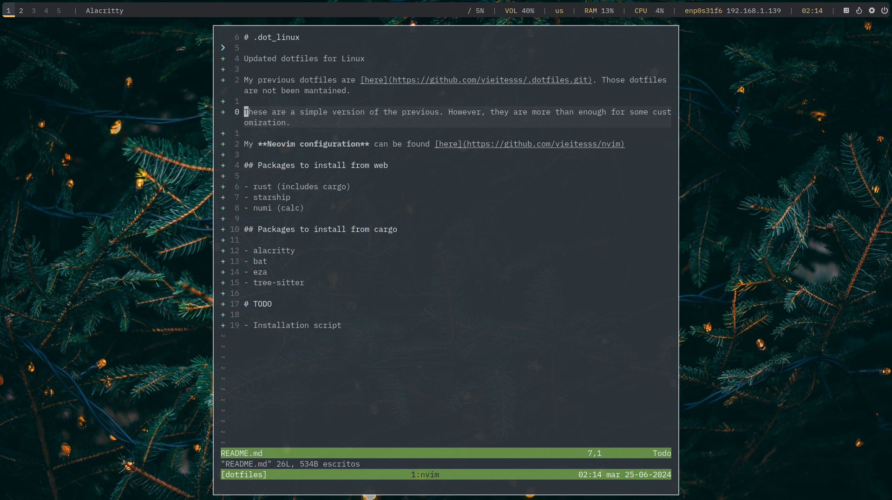

# .dot_linux

Updated dotfiles for Linux

My previous dotfiles are [here](https://github.com/vieitesss/.dotfiles.git). Those dotfiles are not been mantained.

These are a simple version of the previous. However, they are more than enough for some customization.

My **Neovim configuration** can be found [here](https://github.com/vieitesss/nvim)

## Packages to install from web

- rust (includes cargo)
- starship
- numi (calc)

## Packages to install from cargo

- alacritty
- bat
- eza
- tree-sitter

# TODO

- Installation script
